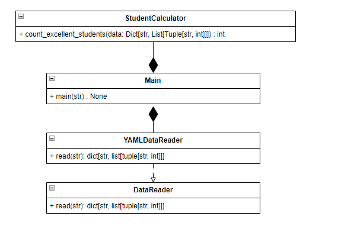

# Лабораторная 1 по дисциплине "Технологии программирования"

## Вариант 1

**Формат входного файла**: YAML

**Расчетная процедура**: Рассчитать и вывести на экран количество студентов отличников (имеющих баллы по всем предметам ≥ 90).

## Используемые технологии:
**Язык программирования:** Python

**Тесты:** Pytest

**Линтер:** Pycodestyle

## Диаграмма классов:

